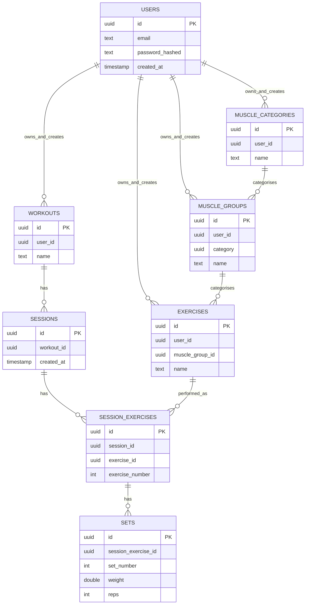

# 🏋️‍♂️ Gym Tracker (Serverless .NET + Vue)

A high-performance, cost-optimized gym tracking application. Built to demonstrate modern **Clean Architecture**, **Serverless System Design**, and a custom **JWT Authentication** implementation.

---

## 🏛️ System Architecture

This project is designed to stay within the **AWS Free Tier** indefinitely. It uses a decoupled frontend and backend hosted on serverless infrastructure.

---

## 📗 Data Model

The database schema follows a relational structure to ensure data integrity and easy reporting on lifting progress over time.

---

## 🔒 Authentication Flow

For learning purposes, this app implements a custom **JWT-based authentication** system using **Argon2id** for password hashing.

---

## 🛠️ Tech Stack

* **Frontend:** Vue 3 (Composition API), TypeScript, Pinia (State), Vite.
* **Backend:** .NET 10 Minimal APIs, Entity Framework Core.
* **Infrastructure:** AWS Lambda (Serverless), S3, CloudFront, GitHub Actions (CI/CD).
* **Database:** PostgreSQL via Neon or Supabase.